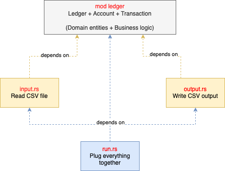

## How to use

```sh
$ cargo run -- transactions.csv > accounts.csv
```

## Design

### Thought process
I built this program for:
- maintenability
- ease of integration with streams instead of files
- robustness

I used the standard library over crates for most problems that needed to be solved.
For problems where I could gain clear value from using a crate, I used one:
- reading CSVs
- serialising and de-serialising
- dealing with decimal places

### Ledger
The `ledger` module is formed with 3 concepts, from smaller to bigger:
- a Transaction contains information about a movement on an account
- an Account is built from a series of transactions, and contains balances
- a Ledger contains many accounts, and can apply transactions to the correct account

### Overview

[TODO] diagram etc.

## Choices

### Multiple representations of the same concept.
I chose to completely split business logic (ledger, account, transactions
logic) from "infrastructure" logic (how to read, write, format CSVs).
This meant creating several representations of the same concept
(e.g. TransactionRecord and Transaction), that would fit better in their given
context.
This would give great flexibility when evolving the code. It also makes each
individual part much simpler to reason about - especially business logic. It
prevents business logic from being tied to infrastructure logic, and prevents
domain entities (Ledger, Account, Transaction) from being influenced by
implementation details.

The drawback is slightly slower prototyping (you could argue that making it easier
to test saved a lot of time, though), more code including TryFrom and From
implementations (again, you could argue that while it's more code in a small
codebase, it's actually less conditional/logic code especially as the project
gets more complex).

### Named types for domain values.

Instead of using standard library types directly (e.g. `u16`, `u32`), I decided
to use named types (i.e. `type ClientId = u16`). Reasons for this are explained
in [mod.rs](./src/ledger/mod.rs).

### Inversion of Control
Instead of using a more naive approach of having my business code depend on CSV
code, I made the `ledger` module unaware of infrastructure details (i.e. CSV),
instead simply expecting a stream of something it knows: Transaction.

In plain English, `input.rs` and `output.rs` both depend types from the `ledger`
module, and `ledger` doesn't depend on anything.



### Channels

TODO

## Correctness

[TODO] I tried to cover as much as a could in a limited time.
For that, I unit tested "green" paths and all edge cases I could think of.
[TODO] To make sure main.rs was properly built and configured, I wrote an end-to-end
test.
[TODO] Finally, to make sure that my program didn't have any massive bottleneck or
any unexpected behaviour when 

## Known limitations/possible improvements

### RustDoc
With more time, one of the first things I would have improved is **the rustdoc**.
I have formatted my documentation for people reading the code and associated
comments, not for documentation generated with `cargo doc`.

### Error handling and recovery
In the current implementation, all errors are simply printed, and we skip to
the next transaction.
When a line in the CSV is not well formatted, we skip it. When a transaction
cannot be applied to the account (e.g. duplicate transaction, insufficient funds)
will be printed and we'll skip to the next transaction.

If I planned to deploy this code to production, I would handle errors more
appropriately than logging them and moving forward. The way would would resolve
transaction errors would depend a lot on business rules, as we could for example
(1) put errored transactions in some kind of queue that humans could review and keep
processing other transactions, or (2) simply block all subsequent transactions for
the account until the problem with the errored transaction is resolved. In any
case, it looked completely out of scope for the current assignment.

### Parallelisation
Before going to production, and depending on volume, I would parallelise some parts
of the program. For example, updating the ledger state (i.e. `ledger.apply()`)
could be parallelised, but we would need to find a way to partition transactions
by client_id to avoid data races.
We could also have multiple instances of this program running in parallel, but
again design decisions would need to be made, to ensure data consistency.
Parallelisation felt out of scope for the assignment.

## TODO:
- e2e test
- ledger.rs tests
- stream reading
- stream writing
- write output
- benchmark
