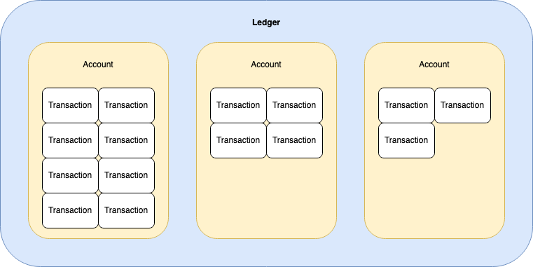
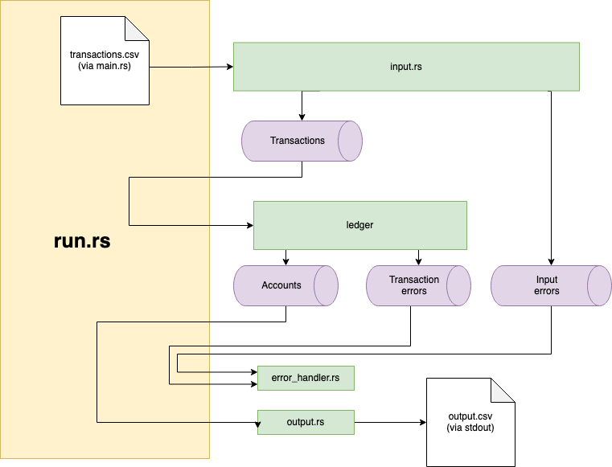

[](https://codecov.io/gh/tsauvajon/transaction_engine)

## How to use

Run the program:
```sh
$ cargo run -- transactions.csv > accounts.csv
```

Run unit and e2e tests:
```sh
$ cargo test
```

Run the smoke test:
```sh
$ ./smoke_test.sh
```

Run the benchmark:
```sh
$ cargo bench
```

## Design

### Thought process
I built this program for:
- maintenability
- ease of integration with streams instead of files
- robustness
- correctness

I used the standard library over crates for most problems that needed to be
solved.
For problems where I could gain clear value from using a crate, I used one:
- reading CSVs: `csv`
- serialising and de-serialising: `serde`
- dealing with decimal places: `rust_decimal`

I also used `criterion` for benchmarking, as a dev dependency.

I didn't feel the need to use asynchronous programming or libraries
(e.g. tokio) or green-thread libraries (again, tokio) for the problem at hand.

### Ledger
The `ledger` module is built around 3 concepts, from smaller to bigger:
- a Transaction contains information about a movement on an account
- an Account is built from a series of transactions, and contains balances
- a Ledger contains many accounts, and can apply transactions to the correct account



### Overview



`run.rs` coordinates the work between the other parts of the application:
- `input.rs` is responsible for parsing the input transactions, and stream transactions + parsing errors,
- `ledger` module is responsible for all the business logic, as explained above, and calculates account balances,
- `output.rs` writes out the account balances, after the ledger starts streaming them,
- `error_handler.rs` will deal with the errors that are streamed to it.

Most of the work is done concurrently, as input, ledger and the error handler
run in their own thread. Besides, they communicate together with `mpsc` channels,
as indicated in purple in the diagram above.

## Choices

### Multiple representations of the same concept.
I chose to completely split business logic (ledger, account, transactions
logic) from "infrastructure" logic (how to read, write, format CSVs).
This meant creating several representations of the same concept
(e.g. TransactionRecord and Transaction), that would fit better in their given
context.
This would give great flexibility when evolving the code. It also makes each
individual part much simpler to reason about - especially business logic. It
prevents business logic from being tied to infrastructure logic, and prevents
domain entities (Ledger, Account, Transaction) from being influenced by
implementation details.

The drawback is slightly slower prototyping (you could argue that making it
easier to test saved a lot of time, though), more code including TryFrom and
From implementations (again, you could argue that while it's more code in a
small codebase, it's actually less conditional/logic code especially as the
project gets more complex).

### Named types for domain values.

Instead of using standard library types directly (e.g. `u16`, `u32`), I decided
to use named types (i.e. `type ClientId = u16`). Reasons for this are explained
in [mod.rs](./src/ledger/mod.rs).

### Inversion of Control
Instead of using a more naive approach of having my business code depend on CSV
code, I made the `ledger` module unaware of infrastructure details (i.e. CSV),
instead simply expecting a stream of something it knows: Transaction.

In plain English, `input.rs` and `output.rs` both depend types from the `ledger`
module, and `ledger` doesn't depend on anything. `main.rs`/`run.rs` depend on
everything but nothing depends on them.


### Channels

Channels make communication between concurrent processes trivial. In our case,
using channels and multiple threads allows to start processing transactions as
soon as the first one is parsed.

## Assumptions


### Transactions format
I didn't consider unexpected amounts (e.g. a dispute with an amount) to be a
problem, they're simply ignored. I did this because I thought it wouldn't
cause any processing issue, and it seems safe to ignore.

I considered additional data (e.g. 7 columns instead of 4) to be a problem, because
it's hard to tell whether the fields we're reading are the correct ones or not.

### Negative amounts
When you dispute a transaction but have an available amount lower than the
transaction amount, your available amount can become negative. I'm making the
assumption that this is ok. It can be resolved later and put the available
amount back on positive.

When you resolve a dispute and have a lower held amount than the transaction
amount, then your held amount can become negative. I don't expect this to
be possible, so in my implementation I return an error if this happens.

## Correctness

I tried to cover as much as a could in a limited time.
For that, I unit tested "green" paths and all edge cases I could think of.
To make sure main.rs was properly built and configured, I wrote an end-to-end
test. 
Run these tests with `cargo test`.

I wrote a smoke test as well, to make sure the
suggested command `cargo run -- transactions.csv > accounts.csv` was properly
working.
Run it with `./smoke_test.sh`

Before submitting the solution, I manually ran the program one last time to
make sure everything was in order. I added some badly formatted lines to check
for errors and checked that the created `account.csv` looked like in the
assignment.
See the input with `transactions.csv`.

Finally, to make sure that my program didn't have any massive bottleneck or
any unexpected behaviour when dealing with larger files, I wrote a simple
benchmark.
Run it with `cargo bench`.
FYI:
```
calc_balances_large_file_140_000
time:   [289.23 ms 304.44 ms 320.50 ms]
```

## Known limitations/possible improvements

### RustDoc
With more time, one of the first things I would have improved is
**the rustdoc**. I have formatted my documentation for people reading the code
and the associated comments, not for documentation generated with `cargo doc`.

### All account states are in memory
While transactions are streamed and not kept in memory, all the accounts and
their states are. This is by design: it would be impossible to build the final
account state without keeping transitional states in memory (unless we write it
on disk or to another system, which would be much more complex, and out of
scope for this program). Account state also include transaction.

To give some examples:
1M transaction records for 10 different transactions, on 2 different accounts
would take very limited space. The transactions would be streamed an only 10
transactions and 2 accounts would be kept in memory.
100k transaction records for 100k different transactions spread over 100k
different accounts would use a lot more, as we'd need to hold 100k accounts
at once in memory and the state of all 100k transactions. Again, this is because
we can never know when we received the last transaction record for a same
transaction id, or for a same account - so we have to reach the end of the
file before we clean anything from memory.

### Error handling and recovery
In the current implementation, all errors are brought back to the `run()`
function, then processed in `output::handle_errors()`. Whenever an error
is found with a transaction, we skip to the next transaction.
When a line in the CSV is not well formatted, we skip it. When a transaction
cannot be applied to the account (e.g. duplicate transaction, insufficient
funds), we'll also skip to the next transaction.

In the current implementation, errors are sinked (see more about this in
`output.rs`).

If I planned to deploy this code to production, I would handle errors more
appropriately than logging them and moving forward. The way would would resolve
transaction errors would depend a lot on business rules, as we could for
example:
(1) put errored transactions in some kind of queue that humans could review and
keep processing other transactions, or
(2) simply block all subsequent transactions for the account until the problem
with the errored transaction is resolved. In any case, it looked completely out
of scope for the current assignment.

### Parallelisation
Before going to production, and depending on volume, I would parallelise some
parts of the program. For example, updating the ledger state
(i.e. `ledger::build()`) could be parallelised, but we would need to find a way
to partition transactions by client_id to avoid data races.

We could also have multiple instances of this program running in parallel, but
again design decisions would need to be made, to ensure data consistency.
Parallelisation felt out of scope for the assignment.
